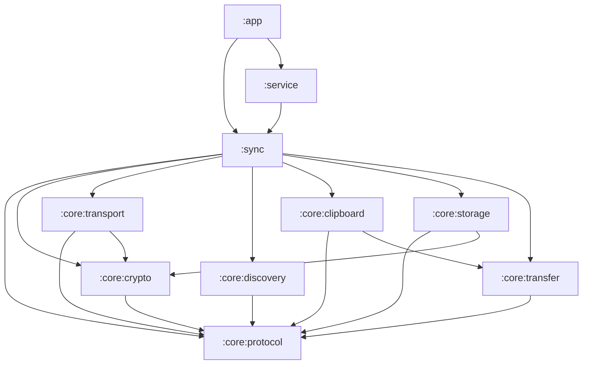

# Synco

Synco keeps one clipboard between an Android phone and a Mac on the same local network.
Copy on the phone, paste on the Mac. Copy on the Mac, paste on the phone.

There is no account, no cloud service, no broker, and no configured IP address anywhere in
the system. The two devices find each other with mDNS, connect directly over TCP, and run
an authenticated, encrypted session whose byte layout is specified in
[PROTOCOL.md](PROTOCOL.md). Trust is established once, by a human comparing a fingerprint
on both screens.

This repository is the Android half. The Mac half lives in `synco-macos`. Both sides
implement the same protocol version (`1`) and both must agree byte for byte.

## What actually syncs

| Kind | On the wire | Notes |
|------|-------------|-------|
| Plain text | inline in the `clip` frame | under 64 KiB encoded |
| HTML | inline | applied alongside the plain text, so pasting into a rich editor keeps formatting and pasting into a terminal degrades to plain text |
| URL | inline | a copied URI that is not a readable file, or copied text beginning `http://` or `https://` |
| Images | streamed as a blob | announced in `clip`, then chunked |
| Files | streamed as a blob | a clip from the Mac that came from a directory keeps its relative path |

The protocol also defines an `rtf` representation. Android has no RTF clipboard type, so
this side neither produces nor applies one; a clip from the Mac that carries RTF also
carries text and usually HTML, and those are what land on the phone's clipboard.

Inline text or HTML that reaches 64 KiB is demoted to a streamed file representation
(`clipboard.txt`, `clipboard.html`) so it never occupies a control frame. The default
per-blob ceiling is 100 MiB and is advertised to the peer in the `caps` message.

A clipboard event is applied all-or-nothing: if a blob fails its SHA-256 check, nothing is
written to the clipboard.

## Requirements

- Android 10 (API 29) or newer. `minSdk` is 29; the app compiles and targets SDK 36.
- A Mac running Synco, on the same Wi-Fi or wired LAN segment.
- For building: the Android SDK, and a JDK — see [Build and install](#build-and-install).

## Architecture

Ten Gradle modules plus a composite `build-logic` build that carries the convention
plugins. Dependencies point one way only; nothing in `core` knows about `sync`, and
nothing below `app` knows about the UI.



| Module | Type | Holds |
|--------|------|-------|
| `:core:protocol` | Kotlin JVM library | The wire contract with no platform dependency: `DeviceId`, `Fingerprint`, `Platform`, frame codec, blob chunk layout, every JSON message type, the canonical clip hash, base32/base64/hex codecs, and all protocol constants. |
| `:core:crypto` | Kotlin JVM library | X25519 identity and ephemeral keys, the handshake key schedule, HKDF, HMAC confirmation tags, and the ChaCha20-Poly1305 session ciphers. Backed by Bouncy Castle. |
| `:core:transport` | Kotlin JVM library | Length-prefixed framing over Ktor sockets, the listener and dialer, the handshake and pairing exchanges, heartbeat, read-timeout watchdog, and reconnect backoff. |
| `:core:discovery` | Android library | `NsdManager` advertising and browsing of `_synco._tcp`, TXT record encode/decode, the resolved-peer registry, and the connectivity callback that notices network changes. |
| `:core:clipboard` | Android library | Reading `ClipboardManager` into protocol representations, writing representations back as a single `ClipData`, and the loop-suppression window. |
| `:core:transfer` | Android library | Blob staging, chunking, SHA-256 verification, safe file naming, progress reporting, and the `FileProvider` paths for received files. |
| `:core:storage` | Android library | Encrypted identity key storage, DataStore-backed settings, and the trusted-peer set. |
| `:sync` | Android library | The engine: the peer registry, dial/wait decisions, per-peer clip routing, direction and type policy, pairing coordination, and the observable `SyncState`. Exposes `SyncoGraph`, the single object every other layer talks to. |
| `:service` | Android library | The foreground service, its notification and actions, the boot receiver, the Quick Settings tile, the wake and multicast locks, and the accessibility service. |
| `:app` | Android application | Compose UI, the view model, and the permission flow. Nothing else. |

`:core:protocol`, `:core:crypto`, and `:core:transport` are plain JVM modules on purpose:
they contain the parts that must be provably identical to the Mac, and they cannot
accidentally reach for an Android API.

## How the phone finds and connects to the Mac

Everything below happens inside the foreground service. Nothing is triggered by opening
the app.

1. **Identity.** On first launch the phone generates an X25519 static key pair. The
   private key is stored in `EncryptedSharedPreferences` and never leaves the device. Its
   public key is hashed to produce a 16-character device id (`did`) and a 16-hex-digit
   fingerprint shown as `A1B2-C3D4-E5F6-0718`.

2. **Listen.** The engine binds a TCP listener on `0.0.0.0` with an OS-chosen ephemeral
   port.

3. **Advertise.** It registers a `_synco._tcp` service on `local.` through `NsdManager`.
   The instance name is the `did` — never the human-readable name, which is neither stable
   nor collision-free. The TXT record carries `v`, `did`, `dn`, `pl`, `fp`.

4. **Browse.** Simultaneously it browses `_synco._tcp`, resolves each result, and drops
   anything whose TXT record does not parse or whose protocol version is not `1`.

5. **Decide who dials.** The device whose `did` sorts lexicographically smaller dials; the
   other one waits. This is deterministic on both sides and removes the duplicate-session
   race that symmetric dialing produces.

6. **Handshake.** Both sides send a plaintext `hello` eagerly, so the handshake costs one
   round trip. Three X25519 operations are combined and fed through HKDF-SHA256 with
   `info = "synco-v1-session"` into two directional keys. Each side proves it holds the
   expected static key with an HMAC tag over `"synco-v1-confirm" || did`. Every frame
   afterwards is ChaCha20-Poly1305 with a per-direction counter.

7. **Stay alive.** A `ping` goes out after 15 s of write idleness; 45 s with no inbound
   frame of any kind kills the connection. Reconnect is exponential backoff with full
   jitter, 1 s base doubling to a 30 s cap, reset on a successful handshake.

8. **Survive network churn.** A connectivity callback watching the Wi-Fi and Ethernet
   transports restarts discovery and re-dials every peer when the link changes. Because a
   peer is always resolved from its `did` at connect time, DHCP renewals, Wi-Fi switches
   and sleep/wake need no user action.

## Why the accessibility service is required

Android 10 (API 29) closed background clipboard access. `ClipboardManager.getPrimaryClip()`
returns `null`, and `OnPrimaryClipChangedListener` never fires, unless the calling UID owns
the currently focused window, is the default input method, or holds
`READ_CLIPBOARD_IN_BACKGROUND` — a privileged `signature` permission a sideloaded app cannot
be granted. A bound `AccessibilityService` is *not* on that list: being kept alive by the
platform does not, on its own, satisfy the focus check. This is why an earlier "re-read on
every window event" design captured almost nothing from Android to Mac — the read only
succeeded in the brief moments a Synco window itself was focused.

The one route an ordinary app does have: an `AccessibilityService` may add a
`TYPE_ACCESSIBILITY_OVERLAY` window without `SYSTEM_ALERT_WINDOW`, and if that window is
focusable, the app's UID becomes the focused UID and `getPrimaryClip()` succeeds. Synco
uses this as a **focus gate**: it adds a 1×1, transparent, focusable overlay, waits for
focus to land, reads the clipboard, and removes the overlay immediately (with a hard
timeout so a device that never grants focus cannot leave the overlay up).

**How a copy is detected.** Opening that overlay steals input focus for a few milliseconds,
so it must fire on real copies, not on every UI event. `SyncoAccessibilityService` feeds a
small, pure detector (`app.synco.clipboard.CopyIntentDetector`) a stream of lightweight
event values and combines three signals:

- a `TYPE_VIEW_CLICKED` / `TYPE_VIEW_LONG_CLICKED` whose text or content description matches
  the copy action label, resolved from the platform string `android.R.string.copy` (so it
  is localised) with a small English fallback set;
- a `TYPE_VIEW_TEXT_SELECTION_CHANGED` shortly followed by a click;
- on Android 13+, the system clipboard-preview window appearing as a
  `TYPE_WINDOW_STATE_CHANGED` from `com.android.systemui` shortly after a selection.

A debounce and rate limit (`app.synco.clipboard.CopyGateThrottle`) collapse a burst of
events so the overlay opens at most once per interval.

**The two capture routes.** Both feed one `ClipboardCapture` flow, so the sync engine never
knows which produced a clip:

- the focus-gate route above, used while Synco is backgrounded;
- the classic `OnPrimaryClipChangedListener`, kept only for when it genuinely works — while
  a Synco activity itself holds focus. Opening the app also triggers a single foreground
  read, so a copy made just before switching to Synco is still picked up.

**What it does not do.** Its configuration
(`service/src/main/res/xml/synco_accessibility_config.xml`) declares
`android:canRetrieveWindowContent="false"` and `android:canRequestFilterKeyEvents="false"`,
and subscribes to exactly the four event types the detector consumes and nothing more. It
never calls `getRootInActiveWindow()`, never walks the view hierarchy, and reads node text
only to compare it against the copy label. No screen content is logged, persisted, or sent
anywhere. The only data that leaves the device is what you explicitly copy, and only to a
Mac you have paired and approved by fingerprint.

**Status the home screen shows.** Background capture is reported in three states: the
service is off (the permissions card offers to turn it on, and the home screen shows "The
clipboard cannot be read right now"); the service is on but no copy has been observed yet;
and it is working, meaning a copy made in another app has reached the gate at least once.

**If you decline.** Synco still works while its own window is in the foreground, and it
still receives clips from the Mac and writes them to the clipboard. What you lose is copies
made in other apps reaching the Mac.

## Build and install

macOS ships no JDK, so you must install one and point `JAVA_HOME` at it. The project was
verified with **JDK 21**.

```sh
brew install openjdk@21
export JAVA_HOME="$(brew --prefix openjdk@21)/libexec/openjdk.jdk/Contents/Home"
export PATH="$JAVA_HOME/bin:$PATH"
```

Without `JAVA_HOME` exported, `./gradlew` fails before it reaches any build logic —
`/usr/libexec/java_home` on a clean macOS install reports "Unable to locate a Java Runtime".
Put the two `export` lines in your shell profile if you do not want to repeat them.

Gradle runs on JDK 21, while the modules themselves compile against Java 17 through a
toolchain. The first build downloads a JDK 17 toolchain automatically via the Foojay
resolver, so it takes noticeably longer than later builds.

Point the build at your Android SDK:

```sh
echo "sdk.dir=$HOME/Library/Android/sdk" > local.properties
```

`local.properties` is git-ignored. Setting `ANDROID_HOME` instead works too.

Then, from the repository root:

```sh
./gradlew :app:assembleDebug
./gradlew :app:installDebug
./gradlew test
```

- `assembleDebug` writes `app/build/outputs/apk/debug/app-debug.apk`.
- `installDebug` installs onto the single connected device or running emulator.
- `test` runs the JVM unit tests of every module, including the shared handshake and clip
  hash vectors that must match the Mac.

The debug build uses application id `app.synco.debug` and version name `1.0.0-debug`, so it
installs side by side with a release build.

`./gradlew :app:assembleRelease` produces a minified, resource-shrunk APK. No signing config
is declared, so the output is `app-release-unsigned.apk`; sign it yourself before
installing.

Toolchain versions are pinned in `gradle/libs.versions.toml`: Gradle 8.14, Android Gradle
Plugin 8.11.1, Kotlin 2.2.0. Configuration cache and build cache are on by default.

## First run and pairing

1. **Install and open Synco on both devices.** Put the phone and the Mac on the same
   Wi-Fi network.

2. **Grant what the top card asks for.** The "Sync needs your attention" card lists only
   what is actually missing:
   - *Allow notifications* — Android requires an ongoing notification for a data-sync
     foreground service. Without it the service cannot stay alive.
   - *Turn on Synco clipboard access* — opens Settings directly at Synco's accessibility
     entry. See the section above for exactly what it does.
   - *Exempt Synco from battery optimisation* — opens the battery optimisation list; find
     Synco and choose "Don't optimise".

3. **Name the phone.** The "This phone" card has a "Name shown on your Mac" field. Type a
   name and confirm it with the tick that appears at the end of the field, or the Done key.
   Changing the name while sync is running restarts the engine so the new name is
   re-advertised in the TXT record.

4. **Turn on "Clipboard sync".** The first switch on the top card starts the foreground
   service. The status line moves to "Looking for your Mac on this network".

5. **Wait for the Mac to appear.** It shows up under "Devices" with the status "Found on
   this network".

6. **Compare fingerprints.** A pairing dialog appears on *both* devices — whichever side
   dialled, each end surfaces the request to its own user and each end requires an explicit
   approval. The phone's dialog names the peer and shows its fingerprint as four
   four-character blocks:

   ```
   A1B2   C3D4   E5F6   0718
   ```

   Your own phone's fingerprint is on the "This phone" card, under "Fingerprint — compare
   this with the one your Mac shows", in the same four blocks. **Read the blocks off both
   screens and check they match, in the same order.** The fingerprint is derived from the
   peer's long-term public key; a mismatch means the device answering is not the device you
   think it is.
   Nothing secret is exchanged during pairing — the whole point of the comparison is that
   it is the only thing standing between you and pairing with the wrong machine.

7. **Tap Pair on both devices.** Both sides must approve. Once each side has recorded the
   other's static public key, the pairing connection closes and the two devices connect
   again — smaller `did` dialling, as always. That second connection runs the normal
   authenticated handshake, now with both static keys known, and the peer's status becomes
   "Connected". Splitting pairing from the authenticated session is what keeps the
   handshake free of conditional branches.

8. **Test it.** Copy some text on the phone, paste on the Mac.

Tapping **Reject** marks the peer rejected and stops the prompts. Use **Forget** on the
peer card to clear that, which also erases the stored key and per-peer direction settings —
after which pairing starts over with a fresh fingerprint comparison.

## Direction toggles

Every device under "Devices" — discovered, paired, or paired but currently offline — gets
its own card with a four-way Direction control and two columns of per-type switches. The
settings are stored per peer and survive the peer going offline.

| Choice | Send flags | Receive flags | Meaning |
|--------|-----------|---------------|---------|
| **Both ways** | on | on | A copy on either device lands on the other. |
| **Phone to Mac** | on | all off | Copies made on this phone reach the Mac. Nothing comes back. |
| **Mac to phone** | all off | on | Copies made on the Mac land on this phone. Nothing is sent out. |
| **Paused** | all off | all off | Nothing moves between this phone and the Mac. |

Picking a choice that switches a side on restores the per-type switches you had on that
side; if that side was completely off, all three types come back on. Picking a choice that
switches a side off clears all three types on that side, so the four buttons are exactly
the four combinations of "send enabled" and "receive enabled".

Underneath, **Send to Mac** and **Accept from Mac** each carry Text, Images and Files
switches, disabled when the corresponding direction is off. These give you the finer
combinations — text both ways but files one way only, for example. **Text** covers every
inline representation: plain text, HTML, RTF and URLs.

Both devices enforce direction independently on every clip, so a single toggle is never
trusted to a single machine. The phone strips representations its send flags forbid before
transmitting, and refuses representations its receive flags forbid on arrival, answering
`ack{applied:false, reason:"typeDisabled"}`. Each side also tells the other what it accepts
via `caps`, which is why the peer card can say "MacBook is not accepting: Files" instead of
silently dropping them.

The **Pause** switch on the top card, and the Pause action on the notification, suppress
both directions on every peer at once without discarding any of the per-type configuration.
The Quick Settings tile starts and stops the service outright.

## Where received files land

Images and files that arrive from the Mac are written under the app's external files
directory:

```
/sdcard/Android/data/app.synco/files/synco/received/
```

For a debug build the application id is suffixed, so the path is
`/sdcard/Android/data/app.synco.debug/files/synco/received/`. If external storage is
unavailable, the same `synco/received` tree is created inside internal app storage instead.

- When the Mac copied from a directory, the file's relative path is rebuilt beneath
  `received/`. Path segments are sanitised and cannot escape that directory.
- A name collision does not overwrite: the file becomes `name (1).ext`, `name (2).ext`,
  and so on.
- Files are staged as `synco/staging/<transferId>.part` while they stream, verified against
  their SHA-256, and only then moved into `received/`. Staging is cleared on shutdown.
- The clipboard entry Synco writes is a `content://` URI served by a `FileProvider` whose
  authority is the application id plus `.files` (`app.synco.files`, or
  `app.synco.debug.files` for a debug build), so pasting into another app works without any
  storage permission.

Nothing here is auto-deleted. If you sync large files often, empty
`Android/data/app.synco/files/synco/received/` yourself from time to time — it is reachable
with any file manager, and uninstalling the app removes it.

## Troubleshooting

**Nothing is discovered, or the Mac disappears after a while.**
mDNS needs a multicast lock on Android, and Synco takes one only while the foreground
service is running. If the "Clipboard sync" switch is off, or you tapped **Stop** on the
notification, discovery is off with it — the lock is released together with the wake lock.
Turn sync back on. If discovery is running but the phone still finds nothing, the home
screen shows "Local network discovery is unavailable"; toggling Wi-Fi off and on restarts
`NsdManager` cleanly, as does toggling sync off and on.

**Clips arrive minutes late, or only when you unlock the phone.**
This is battery optimisation suspending the process. Grant the exemption from the
permissions card (Settings then opens at the battery optimisation list — pick Synco, then
"Don't optimise"). Some manufacturers layer their own aggressive killer on top of the
platform one; on those devices also add Synco to the vendor's protected or auto-start list,
under names like "Battery saver", "App launch" or "Protected apps". Synco holds a partial
wake lock while syncing, but a wake lock does not survive a process the system has frozen
or killed.

**Both devices are on Wi-Fi but they never see each other.**
Almost always one of three network conditions:

- *Different subnets.* mDNS is link-local and is not routed. A phone on a 2.4 GHz guest
  SSID and a Mac on the main 5 GHz SSID are frequently on different subnets even though
  both say "Wi-Fi". Put both on the same SSID.
- *AP isolation.* Guest networks, hotel and café Wi-Fi, and many routers with "client
  isolation" or "AP isolation" enabled block device-to-device traffic entirely. Discovery
  packets never arrive, and even a known IP would not help. Use a network you control, or
  turn client isolation off in the router.
- *A firewall on the Mac.* macOS's firewall can block incoming connections to the Synco
  listener. Allow them. You cannot work around this by "making the phone connect instead" —
  which side dials is decided by comparing device ids, not by a setting.

Synco has no relay, no cloud fallback and no manual-IP entry, by design. If the two devices
cannot reach each other on the local link, there is nothing to fall back to.

**The phone is on mobile data.**
Synco watches only the Wi-Fi and Ethernet transports, and mDNS does not cross a carrier
network. On cellular nothing is discovered and nothing connects; when the phone had Wi-Fi
and lost it, the home screen says "No usable network". This is deliberate — there is no
internet-side service to fall back to.

**"The clipboard cannot be read right now".**
The accessibility service is off or was disabled by the system. Re-enable it from the
permissions card. Note that some Android builds silently switch accessibility services off
after an update or a force-stop.

**Copies from other apps never reach the Mac, but copies made inside Synco do.**
Background capture depends on the accessibility service. If it is off, only foreground
copies reach the Mac — turn it on from the permissions card. If it is on but the home
screen still says a copy has not been observed yet, make an ordinary copy in another app
(select text and tap Copy): the focus gate fires on that gesture, and the status flips to
working once the first copy comes through.

**A file never arrives.**
Check the peer card. If the Mac's `caps` say it is not accepting files, the card says so.
A blob larger than the peer's advertised `maxBlob` (100 MiB by default) is refused with
`tooLarge` rather than truncated, and a SHA-256 mismatch aborts the whole clip rather than
pasting half of it.

## Icons

The launcher icon set is already in place. When the owner supplies replacements, drop them
at exactly these paths, keeping the file names — the adaptive icon XML and the manifest
reference them by name.

**Launcher icon, `:app` module.** Five density buckets of square, lossless WebP. PNG works
equally well — resources are referenced by name, not extension — but *replace* the existing
file rather than adding `ic_launcher.png` next to `ic_launcher.webp`, since two files with
the same resource name in one directory is a build error.

| Path | Size |
|------|------|
| `app/src/main/res/mipmap-mdpi/ic_launcher.webp` | 48 × 48 |
| `app/src/main/res/mipmap-hdpi/ic_launcher.webp` | 72 × 72 |
| `app/src/main/res/mipmap-xhdpi/ic_launcher.webp` | 96 × 96 |
| `app/src/main/res/mipmap-xxhdpi/ic_launcher.webp` | 144 × 144 |
| `app/src/main/res/mipmap-xxxhdpi/ic_launcher.webp` | 192 × 192 |

`ic_launcher_round.webp` sits beside each of those at the same five sizes.

**Adaptive icon layers, `:app` module.** Three files per density —
`ic_launcher_background.webp`, `ic_launcher_foreground.webp`, `ic_launcher_monochrome.webp`
— in the same `mipmap-*` directories, at 108 / 162 / 216 / 324 / 432 px for
mdpi / hdpi / xhdpi / xxhdpi / xxxhdpi. Keep the artwork inside the middle 66 dp of the
108 dp canvas; the outer ring is masked away. The monochrome layer must be a single-colour
silhouette on transparency, since Android tints it for themed icons.
`app/src/main/res/mipmap-anydpi-v26/ic_launcher.xml` and `ic_launcher_round.xml` already
wire these three layers together and need no change.

**Play Store listing icon.** `app/src/main/ic_launcher-playstore.png`, 512 × 512. It lives
outside `res/`, is not compiled into the APK, and is only used when uploading.

**Notification and Quick Settings icons, `:service` module.** These are 24 dp vector
drawables and must stay pure white on transparency — Android tints and masks them, so any
colour or gradient is discarded and any non-opaque interior turns into a solid blob.

| Path | Used by |
|------|---------|
| `service/src/main/res/drawable/ic_synco_notification.xml` | the ongoing foreground-service notification |
| `service/src/main/res/drawable/ic_synco_sync.xml` | the Quick Settings tile |
| `service/src/main/res/drawable/ic_synco_pause.xml` | notification Pause action |
| `service/src/main/res/drawable/ic_synco_resume.xml` | notification Resume action |
| `service/src/main/res/drawable/ic_synco_stop.xml` | notification Stop action |

**One leftover.** `app/src/main/res/drawable-{mdpi,hdpi,xhdpi,xxhdpi,xxxhdpi}/ic_stat_name.png`
(24 / 36 / 48 / 72 / 96 px) is a raster status-bar icon set generated by Image Asset Studio.
Nothing references it: the notification uses the vector `ic_synco_notification` from the
`:service` module. If the owner supplies a status-bar icon, replacing
`ic_synco_notification.xml` is the change that has an effect; the `ic_stat_name` set can
then be deleted.

## Protocol

[PROTOCOL.md](PROTOCOL.md) is normative and is duplicated byte for byte in `synco-macos`.
Read it before changing anything on the wire, and read
[CONTRIBUTING.md](CONTRIBUTING.md) for how to land a protocol change across both
repositories without breaking the other side.

## License

MIT. See [LICENSE](LICENSE).
