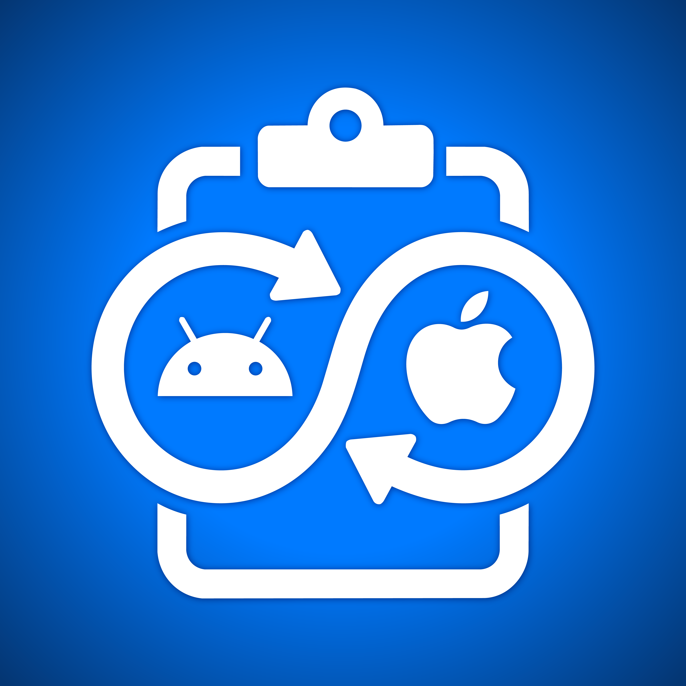

<div style="width: 100%; text-align: center;">
  
</div>

# Synco for Android - Sync Clipboard Between your Mac and Android Phone

One clipboard shared between your Android phone and your Mac, over your own
network. Copy on one, paste on the other. Text, links, images and files.

Nothing leaves your local network. There is no account, no server and no cloud.
The two devices find each other by themselves and keep working after a reboot, a
new Wi-Fi network or a changed IP address.

The Mac side lives in [synco-macos](https://github.com/OneAboveAll1964/synco-macos).

## How it works

Both devices announce themselves on the local network and connect directly. The
connection is encrypted end to end, and you confirm a short fingerprint once per
device so nobody else can pair with you.

Everything about how the two sides talk is written down in
[PROTOCOL.md](PROTOCOL.md), which is identical in both repositories.

## Reading the clipboard

Since Android 10, an app can only read the clipboard while it owns the window you
are looking at. That was done to stop apps snooping on what you copy, and it
applies to Synco too. There is no permission a normal app can ask for to get
around it.

Synco offers two ways to live with that. **Accessibility is the default.**

**Accessibility service.** When Synco notices you may have copied something, it
puts an invisible one-pixel window on screen for a few milliseconds. That makes
Android treat Synco as the focused app for an instant, long enough to read the
clip, and then the window goes away.

It works on any phone with nothing else installed. The costs are real and worth
knowing:

- Focus flickers to Synco for an instant on each copy.
- It has to guess *when* you copied, because Android does not tell a background
  app that the clipboard changed. Most copies are caught; an occasional one is
  not.
- Google Play does not allow the accessibility API to be used this way, so Synco
  is not on Play and is installed by hand.

**Shizuku, optional and more reliable.** [Shizuku](https://shizuku.rikka.app)
lets an app borrow the same level of access a computer has over USB. With it,
Synco reads the clipboard directly: no invisible window, no focus flicker, no
guessing, and nothing missed.

The trade is that you install Shizuku and start it again after each reboot, using
wireless debugging or a rooted phone.

Choose Shizuku if you want it to simply work. Choose accessibility if you would
rather not install anything else. If you pick Shizuku and it later is not
running, Synco falls back to accessibility and tells you why.

## Installing

Grab the APK from [Releases](https://github.com/OneAboveAll1964/synco-android/releases)
and install it. Android will warn about installing outside the Play Store, which
is expected: Synco cannot be on Play, for the reason above.

To build it yourself:

```bash
export JAVA_HOME=/path/to/jdk-21
./gradlew assembleDebug
adb install -r app/build/outputs/apk/debug/app-debug.apk
```

macOS ships without a JDK, so `JAVA_HOME` has to point at one. Built and tested
with JDK 21.

## First run

1. Open Synco on the phone and on the Mac.
2. Turn **Clipboard sync** on.
3. Each device offers to pair with the other. Approve on both, and check the
   four-block fingerprint matches. That check is what stops someone else on the
   network pairing with you.
4. Turn on **Synco clipboard access** when asked, or switch to Shizuku.

## Settings

**Direction.** Per device, in four combinations: both ways, phone to Mac only,
Mac to phone only, or paused. Text, images and files can each be turned on and
off separately in each direction. Changing this on either device changes it on
the other, and a change made while disconnected is applied on the next
connection.

**Where received files go.** By default files land somewhere you cannot browse.
Pick a folder and they land there instead, with a notification each time. Android
will not let you pick `Download` or the storage root itself, so open one and pick
a folder inside it, or make a new one.

**Largest file.** Anything bigger is refused in both directions. Each device has
its own limit and the smaller of the two wins.

**Capture tuning.** How long to wait for the clipboard, how long to wait for
focus, and how many times to re-read after a tap. Raise these if copies are
missed on a slower phone; lower them if Synco feels intrusive.

## If something is not syncing

- **Copies are missed.** Turn on Synco clipboard access, or switch to Shizuku.
  Raising the capture tuning values helps on slower phones.
- **The devices cannot see each other.** They must be on the same network, and
  some routers stop devices talking to each other. Guest networks usually do.
- **It stops when the screen is off.** Exempt Synco from battery optimisation.
- **A file did not arrive.** It is probably larger than the limit on one of the
  two devices.

## Licence

MIT. See [LICENSE](LICENSE).

Made by [OneAboveAll1964](https://github.com/OneAboveAll1964).
